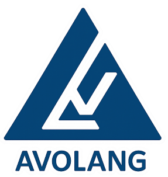

<p align="center">
  
</p>

# Make It Sticky

`makeitsticky` ist ein Codex-Skill für sichere Sticky-, Stacking- und Scroll-Sektionen in Websites. Er hilft dabei, visuell starke Scroll-Übergänge zu entwickeln oder bestehende Implementierungen zu reparieren, ohne Inhalte abzuschneiden, dauerhaft auszublenden oder auf kleinen Viewports unbenutzbar zu machen.

## Was der Skill macht

- untersucht die vorhandene Seiten-, Section- und Overflow-Struktur;
- wählt abhängig von Inhalt und verfügbarer Viewport-Höhe einen sicheren Sticky-Modus;
- behandelt Sticky-Effekte als progressive Verbesserung;
- trennt die Sticky-Geometrie vom visuellen Text-Fade;
- schützt Bilder, Videos, SVGs, Formulare und dynamische Bereiche;
- berücksichtigt Touch-Geräte und `prefers-reduced-motion`;
- definiert eine Browser-QA-Matrix für Scrollen, Rückscrollen, Breakpoints und Ankerlinks.

## Typische Einsatzfälle

- Überschriften sollen beim Scrollen unter der Navigation stehen bleiben.
- Aufeinanderfolgende Sektionen sollen sich sauber überdecken.
- Sticky-Inhalte verschwinden zu früh, überlagern Text oder werden abgeschnitten.
- Text soll am Ende einer Sektion ausblenden, während Medien sichtbar bleiben.
- Eine bestehende Scroll-Animation funktioniert nur auf einzelnen Viewport-Größen.

## Sicherheitsprinzip

Der Skill priorisiert Inhaltssicherheit vor Animation. Inhalte bleiben im DOM und im normalen Dokumentfluss. Unsichere oder dynamische Bereiche erhalten einen Opt-out, und ohne JavaScript, auf Touch-Geräten oder bei reduzierter Bewegung bleibt die Seite vollständig sichtbar und bedienbar.

## Verwendung

Nach der Installation kann der Skill in Codex mit `$makeitsticky` aufgerufen werden, zum Beispiel:

```text
Nutze $makeitsticky, um die Sticky-Überschriften dieser Landingpage zu prüfen und sicher zu reparieren.
```

Die vollständigen Arbeits- und Prüfregeln stehen in [`SKILL.md`](SKILL.md). Die UI-Metadaten befinden sich in [`agents/openai.yaml`](agents/openai.yaml).

## Avolang

Entwickelt von [Avolang](https://www.avolang.de) für robuste, zugängliche und wartbare Web-Erlebnisse.

Kontakt: [info@avolang.de](mailto:info@avolang.de)

## Lizenz

Der Skill-Code und die Dokumentation stehen unter der [MIT-Lizenz](LICENSE). Der Name Avolang, das Avolang-Logo und sämtliche Dateien im Verzeichnis `assets/` sind davon ausdrücklich ausgenommen und bleiben vollständig geschützt. Für diese Markenelemente gilt die separate [Avolang Brand Assets License](assets/LICENSE).

Das öffentliche Repository darf angesehen und geforkt werden. Direkte Änderungen am Original-Repository können ausschließlich durch dessen Eigentümer oder von ihm ausdrücklich berechtigte GitHub-Konten vorgenommen werden.
